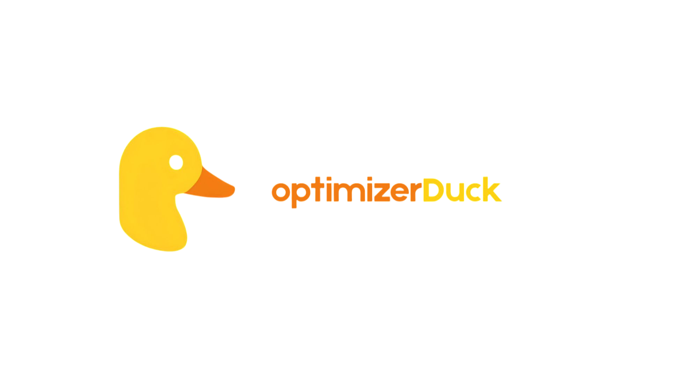

# Getting Started

This is a step-by-step guide to help you get started with optimizerDuck.

## 📦 Download

1. [Download the latest release](https://github.com/itsfatduck/optimizerDuck/releases/latest).
2. Run the `.exe` file.
3. Restart your PC for tweaks to take effect.

## Acknowledgments

See [Acknowledgments](../THIRD-PARTY-NOTICES.md) for **credits and acknowledgments**.
