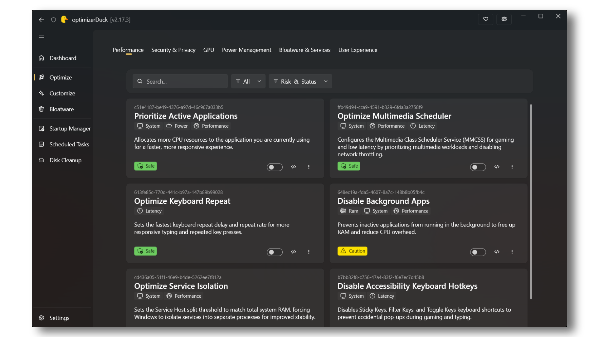

# [optimizerDuck](https://optimizerduck.vercel.app/)

**‏optimizerDuck أداة مجانية مفتوحة المصدر لتحسين ويندوز، تركّز على الأداء والخصوصية والبساطة.**

 

 

**[البداية السريعة](https://optimizerduck.vercel.app/docs/guides/getting-started) | [كيف يعمل](https://optimizerduck.vercel.app/docs/guides/how-it-works) | [الأسئلة الشائعة](https://optimizerduck.vercel.app/docs/faq/general)**

[English](README.md) | [Tiếng Việt](README.vi.md) | [繁體中文](README.zh-TW.md) | [简体中文](README.zh-CN.md) | [Русский](README.ru-RU.md) | [Français](README.fr-FR.md) | [한국어](README.ko-KR.md) | [Español](README.es-ES.md) | [日本語](README.ja-JP.md) | [Polski](README.pl-PL.md) | [Português (BR)](README.pt-BR.md) | [Türkçe](README.tr-TR.md) | **العربية**

⭐ سجل النجوم

إذا ساعدك optimizerDuck في تحسين جهازك، ففكّر في منح المستودع ⭐ ومشاركته مع الآخرين.
كل نجمة تساعد على تحفيز التحسينات القادمة.

 <a href="https://www.star-history.com/itsfatduck/optimizerduck">
  <picture>
   <source media="(prefers-color-scheme: dark)" srcset="https://api.star-history.com/badge?repo=itsfatduck/optimizerDuck&theme=dark" />
   <source media="(prefers-color-scheme: light)" srcset="https://api.star-history.com/badge?repo=itsfatduck/optimizerDuck" />
   
  </picture>
 </a>

<a href="https://www.star-history.com/?repos=itsfatduck%2FoptimizerDuck&type=date&legend=top-left">
 <picture>
   <source media="(prefers-color-scheme: dark)" srcset="https://api.star-history.com/chart?repos=itsfatduck/optimizerDuck&type=date&theme=dark&legend=top-left&sealed_token=UNXQhgyDBTZTQe1TE_Amu7Y7vpRg39O9VlDWdODQoVZHQMYgQvez_20mmRYsz_G_4P0WqF9EcECI9q3FgCwrudjZ0tvJ6st0cC6W0H6RPKncHmlV1RtXn1ys51oMBWeTQ8nkSmR9huOtNdEp4jh_wiWqmmc7j6HgfHRK9WlbIoHnGgLyskwm6agLLmWR" />
   <source media="(prefers-color-scheme: light)" srcset="https://api.star-history.com/chart?repos=itsfatduck/optimizerDuck&type=date&legend=top-left&sealed_token=UNXQhgyDBTZTQe1TE_Amu7Y7vpRg39O9VlDWdODQoVZHQMYgQvez_20mmRYsz_G_4P0WqF9EcECI9q3FgCwrudjZ0tvJ6st0cC6W0H6RPKncHmlV1RtXn1ys51oMBWeTQ8nkSmR9huOtNdEp4jh_wiWqmmc7j6HgfHRK9WlbIoHnGgLyskwm6agLLmWR" />
   
 </picture>
</a>

<a href="https://starmapper.bruniaux.com/itsfatduck/optimizerDuck">
  <picture>
    <source media="(prefers-color-scheme: dark)" srcset="https://starmapper.bruniaux.com/api/map-image/itsfatduck/optimizerDuck?theme=dark" />
    <source media="(prefers-color-scheme: light)" srcset="https://starmapper.bruniaux.com/api/map-image/itsfatduck/optimizerDuck?theme=light" />
    
  </picture>
</a>

---

## البداية السريعة

1. حمّل الأداة من **[صفحة الإصدارات على GitHub](https://github.com/itsfatduck/optimizerDuck/releases/latest)**
2. شغّل ملف `.exe` مباشرة، لا حاجة إلى تثبيت
3. اختر التحسينات التي تريدها وطبّقها، ثم أعد تشغيل الجهاز عندما تكون جاهزًا

> [!TIP]
> أنشئ دائمًا **نقطة استعادة للنظام** قبل إجراء أي تغييرات.

> [!NOTE]
> | | اللغة | الاسم الأصلي | المترجم |
> |------|----------|-------------|------------|
> | 🇺🇸 | الإنجليزية (الولايات المتحدة) | English | الأساسية والموصى بها |
> | 🇻🇳 | الفيتنامية | Tiếng Việt | [itsfatduck](https://github.com/itsfatduck) |
> | 🇹🇼 | الصينية التقليدية | 正體中文 | [abc0922001](https://github.com/abc0922001) |
> | 🇨🇳 | الصينية المبسّطة | 简体中文 | [wcxu21](https://github.com/wcxu21) |
> | 🇷🇺 | الروسية | Русский | [Foodhead](https://github.com/Foodhead) |
> | 🇫🇷 | الفرنسية | Français | [Robocnop](https://github.com/Robocnop) |
> | 🇩🇪 | الألمانية | Deutsch | [pixeldepartment](https://github.com/pixeldepartment) |
> | 🇮🇱 | العبرية | עברית | [yosef-chai](https://github.com/yosef-chai) |
> | 🇰🇷 | الكورية | 한국어 | [klfnn](https://github.com/klfnn) |
> | 🇪🇸 | الإسبانية | Español | [thexxtt](https://github.com/thexxtt) |
> | 🇯🇵 | اليابانية | 日本語 | [zerofrip](https://github.com/zerofrip) |
> | 🇵🇱 | البولندية | Polski | [dudus2000](https://github.com/dudus2000) |
> | 🇧🇷 | البرتغالية (البرازيل) | Português (Brasil) | [mhanelia](https://github.com/mhanelia) |
> | 🇹🇷 | التركية | Türkçe | [amhunter1](https://github.com/amhunter1) |
> | 🇸🇦 | العربية | العربية | [s5xx5s](https://github.com/s5xx5s) |
>
> تريد إضافة لغتك؟ راجع [CONTRIBUTING.md](./CONTRIBUTING.md) ([اليابانية](./CONTRIBUTING.ja-JP.md)، [التركية](./CONTRIBUTING.tr-TR.md)).

---

## ما الذي يفعله optimizerDuck ولماذا يهم

يعمل ويندوز بشكل ممتاز افتراضيًا. لكن أي تثبيت جديد يتضمن أيضًا خدمات تعمل في الخلفية، وقياسًا عن بُعد (Telemetry)، وتطبيقات مثبّتة مسبقًا، ومهامًّ مجدولة تستمر في العمل حتى لو لم تستخدمها أبدًا. وهذه تستهلك موارد النظام مثل المعالج والذاكرة والقرص والشبكة في الخلفية.

وفي الوقت نفسه، هناك إعدادات كثيرة قادرة على تحسين الأداء أو تقليل زمن الاستجابة أو توفير تجربة أكثر سلاسة، لكنها غير مفعّلة افتراضيًا.

يجمع optimizerDuck كل ذلك في مكان واحد. يساعدك على تحسين ويندوز، وإزالة المكوّنات غير الضرورية، وتخصيص إعدادات النظام، وإدارة ميزات ويندوز الشائعة دون التنقيب في الريجستري أو نهج المجموعة (Group Policy) أو PowerShell.

كما يتضمن أدوات إدارة مدمجة تتيح لك رؤية ما يعمل، وإزالة ما لا تحتاجه، واستعادة التغييرات وقتما لزم.

**[لماذا نحسّن ويندوز؟](#لماذا-نحسّن-ويندوز-بدل-ترقية-العتاد-فقط)**

### تحسينات النظام

أكثر من 30 تعديلًا موزّعة على 6 فئات، لكل منها وصف واضح وتقييم للخطورة، لتعرف بالضبط ما يفعله كل تغيير قبل تطبيقه.

| الفئة | ما تغطيه |
| :--- | :--- |
| **الأداء** | ضبط تقسيم Service Host حسب حجم ذاكرتك، وتعديل أولويات العمليات، وتقليل زمن استجابة لوحة المفاتيح، وتحسينات مجدول الوسائط المتعددة للعب أكثر سلاسة |
| **الخصوصية** | تعطيل القياس عن بُعد (Telemetry) وتقارير الأخطاء ومعرّف الإعلانات وتتبّع الموقع و Cortana و Copilot واقتراحات المحتوى |
| **معالج الرسومات** | تعديلات ريجستري خاصة بكل مُصنِّع لكروت AMD و NVIDIA و Intel، تشمل حالات الطاقة وتقنين الترددات وزمن استجابة العرض |
| **الطاقة** | تعطيل الإسبات وبدء التشغيل السريع، وإيقاف التعليق الانتقائي لمنافذ USB، وتثبيت خطة طاقة مخصصة عالية الأداء، وتعطيل خنق الطاقة |
| **التطبيقات المرفقة والخدمات** | منع إعادة تثبيت تطبيقات الشركة المصنّعة، وضبط أنواع بدء التشغيل لأكثر من 200 خدمة في ويندوز |
| **تجربة المستخدم** | إزالة تأخير ظهور القوائم، وتعطيل المؤثرات البصرية مثل حركات شريط المهام والشفافية للحصول على استجابة أسرع |

> [!NOTE]
> التحسينات هنا مستندة إلى بحث في أدوات معروفة ذات قواعد مستخدمين كبيرة، ولا شيء منها مولّد آليًا أو مُضاف عشوائيًا. كل تعديل مختار لأثره الحقيقي على أرض الواقع.

### التخصيص

لا حاجة للتنقيب في الريجستري، فقط مفاتيح تبديل وقوائم منسدلة وحقول رقمية في مكان واحد. وهي منظّمة في أربع فئات:

- **سطح المكتب**: إظهار أو إخفاء الأيقونات (هذا الكمبيوتر، سلة المحذوفات، الشبكة، ملفات المستخدم، لوحة التحكم)، وإزالة سهم الاختصار المتراكب
- **التفضيلات**: محاذاة شريط المهام، والأدوات المصغّرة، وزرّي عرض المهام وإنهاء المهمة، والثواني في الساعة، والوضع الداكن، وامتدادات الملفات، والملفات المخفية، وسجل الحافظة، والعرض المضغوط، ومساعد الإرساء، ومربعات اختيار العناصر، وقائمة السياق الكلاسيكية، وبحث Bing
- **الألعاب**: وضع الألعاب، و Game Bar، والتسجيل في الخلفية، وتسريع الفأرة، وتحسينات ملء الشاشة، وجدولة معالج الرسومات المُسرَّعة بالعتاد
- **النظام**: تفعيل NumLock عند الإقلاع

### الأدوات المدمجة

| الأداة | ما تفعله |
| :--- | :--- |
| **لوحة معلومات النظام** | اعرض تفاصيل المعالج والذاكرة وكرت الشاشة وأقراص التخزين ونظام التشغيل في لوحة واحدة |
| **مدير بدء التشغيل** | شاهد كل تطبيق ومهمة تعمل عند الإقلاع، وفعّلها أو عطّلها، وافتح موقع ملفها |
| **المهام المجدولة** | تصفّح مهام ويندوز المجدولة وشغّلها أو أوقفها أو فعّلها أو عطّلها أو احذفها |
| **تنظيف القرص** | افحص وامسح الملفات المؤقتة وذاكرة النظام المخبّأة وبقايا تحديثات ويندوز والتحميل المسبق والصور المصغّرة وسلة المحذوفات وملفات تفريغ الأعطال وتثبيتات ويندوز القديمة |
| **مزيل التطبيقات المرفقة** | يسرد جميع حزم AppX القابلة للإزالة مع شارات خطورة (آمن، بحذر، غير معروف) لتختار ما تريد إزالته |

### لماذا نحسّن ويندوز بدل ترقية العتاد فقط؟

أسرع طريقة لتحسين الأداء هي دائمًا ترقية العتاد. معالج أفضل، أو كرت شاشة أقوى، أو ذاكرة أكبر، أو قرص SSD أسرع، كلها ستمنحك تحسينًا أكبر بكثير من التعديلات البرمجية وحدها.

لكن العتاد جزء واحد من الصورة.

صُمِّم ويندوز ليعمل على مئات الملايين من الأجهزة باختلاف عتادها وأحمالها ومستخدميها. ولهذا تشحن مايكروسوفت ويندوز بإعدادات تعطي الأولوية للتوافق والاستقرار وعمر البطارية وسهولة الاستخدام، بدلًا من الأداء الأقصى.

والنتيجة أن تثبيت ويندوز الافتراضي يتضمن كثيرًا من الخدمات العاملة في الخلفية والمهام المجدولة والقياس عن بُعد وميزات توفير الطاقة والتطبيقات المثبّتة مسبقًا التي قد لا يحتاجها كثير من المستخدمين أبدًا.

وهذا يصدق بشكل خاص بعد إعادة تثبيت ويندوز. فحتى بعد تثبيت جميع التعريفات والتحديثات، تبقى إعدادات مفيدة كثيرة متعلقة بالأداء دون تغيير، بينما تستمر المكوّنات غير الضرورية في العمل بالخلفية.

تحسين ويندوز ببساطة هو تقليل الأعباء غير الضرورية حتى يصرف جهازك موارده على ما يهمك فعلًا، سواء كان ألعابًا أو برمجة أو إنتاج محتوى أو عملًا يوميًا.

لن يضاعف عدد الإطارات لديك بطريقة سحرية، لكنه قادر على تقليل النشاط في الخلفية، وخفض زمن استجابة النظام، وتحسين سرعة الاستجابة، ومساعدة عتادك على الأداء بثبات أكبر.

وهذا أيضًا أحد أسباب ترشيح كثيرين لنظام لينكس لأداء أفضل وأعباء نظام أقل. فإذا كنت تفضّل البقاء على ويندوز لتوافق برامجه وتجربته المألوفة، فإن optimizerDuck يساعدك على الحصول على أفضل تجربة ممكنة دون تغيير نظام التشغيل.

### متى ينبغي أن أحسّن ويندوز؟

أفضل وقت هو **بعد إعداد تثبيت جديد لويندوز**.

نوصي بهذا الترتيب:

1. ثبّت ويندوز.
2. ثبّت جميع تعريفات العتاد (اللوحة الأم، كرت الشاشة، الشبكة، الصوت، وغيرها).
3. شغّل **Windows Update** حتى لا تبقى تحديثات متاحة.
4. ثبّت جميع **التحديثات الاختيارية**.
5. افتح **Microsoft Store** وحدّث جميع التطبيقات المدمجة.
6. ثبّت البرامج والألعاب التي تستخدمها عادةً.
7. طبّق تحسينات optimizerDuck التي تفضّلها.
8. استخدم أدوات optimizerDuck المدمجة لإزالة التطبيقات غير الضرورية وتنظيف ويندوز وإدارة برامج بدء التشغيل.

اتباع هذا الترتيب يساعد على تجنّب قيام تحديثات ويندوز أو التعريفات بإلغاء تحسيناتك لاحقًا.

> [!TIP]
> يختار كثير من المستخدمين المتقدمين تعطيل تحديثات ويندوز التلقائية مؤقتًا بعد الانتهاء من الإعداد. فالتحديثات الكبيرة قد تعيد الإعدادات الافتراضية أو تعيد تثبيت مكوّنات معينة أو تلغي بعض التحسينات. وإذا فعلت ذلك، فتذكّر إعادة تفعيل Windows Update دوريًا لتثبيت التحديثات الأمنية المهمة قبل تعطيله مجددًا.

> [!NOTE]
> كل تحسين يوفّره optimizerDuck يمكن تنفيذه يدويًا أيضًا. الهدف من optimizerDuck هو ببساطة جعل تحسين ويندوز أسهل وأأمن وأكثر راحة.

---

## الأمان

تغيير إعدادات النظام ينطوي على مخاطرة. وقد بُني optimizerDuck حول مبدأ قابلية التراجع وتحكّم المستخدم.

راجع [سياسة الخصوصية](./PRIVACY.md) لتفاصيل ممارساتنا في التعامل مع البيانات.

- **نسخ احتياطية تلقائية**: كل تغيير يكتب ملف تراجع في مجلد محلي. يمكنك استعادة تعديل بعينه أو التراجع عن كل شيء
- **تراجع بنقرة واحدة**: تراجع عن أي تحسين مُطبَّق من الواجهة بنقرة واحدة
- **تقييمات الخطورة**: كل تعديل موسوم بـ آمن أو بحذر أو للخبراء بحسب أثره المحتمل
- **لا شيء مُفعّل افتراضيًا**: لا يعمل شيء حتى تختاره أنت. الأداة لا تفعّل أي شيء من تلقاء نفسها
- **اقتراح نقطة استعادة**: قبل أول تحسين، يقترح التطبيق إنشاء نقطة استعادة لويندوز

---

## الأسئلة الشائعة

> [!TIP]
> زُر [صفحة الأسئلة الشائعة على الموقع](https://optimizerduck.vercel.app/docs/faq/general) لمزيد من الأسئلة والأجوبة.

### هل استخدام optimizerDuck آمن؟

نعم. optimizerDuck **مفتوح المصدر** بالكامل (رخصة GPL v3)، ما يعني أن بإمكان أي شخص فحص الكود المصدري أو تدقيقه أو بناؤه بنفسه. وكل إصدار يُبنى تلقائيًا عبر **GitHub Actions** من المصدر العلني؛ بلا تعديلات خفية ولا ملفات تنفيذية غير موقّعة تُحقن بعد البناء. وإذا فضّلت، يمكنك استنساخ المستودع وبناء ملف `.exe` بنفسك بأمر `dotnet build` واحد.

التطبيق **لا** يجمع أي قياسات عن بُعد أو بيانات استخدام أو معلومات شخصية. راجع [سياسة الخصوصية](./PRIVACY.md).

### هل يحسّن optimizerDuck الأداء فعلًا، أو يقلل زمن الاستجابة، أو يسرّع الشبكة؟

قد يساعد. كل تحسين في optimizerDuck **مستند إلى بحث في أدوات معروفة وأدلة المجتمع وتوصيات مصنّعي العتاد**، ولا شيء منه مولّد آليًا أو مُضاف عشوائيًا أو مختلق. وكل تعديل يعالج إعدادًا حقيقيًا يضبطه ويندوز بتحفّظ افتراضيًا (مثل تجميع Service Host، وحالات طاقة كرت الشاشة، وخنق الشبكة، وجدولة العمليات).

لا توجد هنا حيل ريجستري وهمية؛ فلكل تغيير غرض موثّق وأثر حقيقي مدعوم باختبارات المجتمع ووثائق المصنّعين.

### لماذا يحذّر Windows SmartScreen أو Defender عند التحميل؟

‏optimizerDuck غير موقّع رقميًا لأن شهادات توقيع الكود مكلفة على المشاريع مفتوحة المصدر. وعندما يصادف ويندوز ملفًا تنفيذيًا غير موقّع مُنزَّلًا من الإنترنت، يعرض SmartScreen تحذيرًا افتراضيًا. هذا أمر طبيعي و**لا** يعني أن الملف غير آمن.

لتجاوزه، اضغط **"More info" ثم "Run anyway"**. وإذا كنت ما زلت قلقًا:

- ابنِ ملف `.exe` بنفسك من [المصدر](https://github.com/itsfatduck/optimizerDuck)
- ارفع الملف إلى بيئات تحليل مثل ANY.RUN للتحقق المستقل

### هل يمكنني التراجع عن التغييرات إذا حدث خطأ؟

نعم. كل تحسين ينشئ ملف تراجع قبل التطبيق. يمكنك التراجع عن تعديلات مفردة أو عن كل شيء من الواجهة بنقرة واحدة. كما يقترح التطبيق إنشاء نقطة استعادة لويندوز قبل أول تحسين.

### هل يعمل على ويندوز 10 وويندوز 11؟

نعم. يدعم optimizerDuck **ويندوز 10 (‏x64)** و**ويندوز 11 (‏x64)**.

### هل أحتاج صلاحيات مسؤول؟

نعم. يعدّل optimizerDuck إعدادات النظام وريجستري ويندوز، لذا يتطلب صلاحيات المسؤول للعمل.

### هل يجمع optimizerDuck بياناتي؟

لا. التطبيق خالٍ تمامًا من القياس عن بُعد والتحليلات وأي اتصال خارجي. يعمل بالكامل دون اتصال ولا يرسل أي بيانات إلى أي جهة.

### لماذا تُظهر إدارة المهام استهلاك معالج 100% بعد تطبيق خطة الطاقة؟ ([#29](https://github.com/itsfatduck/optimizerDuck/issues/29))

خلل عرض معروف في إدارة المهام تسببه خطط الطاقة غير الافتراضية، فتُبلّغ خطأً عن استهلاك 100% للمعالج على بعض الأجهزة بينما الحمل الفعلي طبيعي. المشكلة بصرية فقط و**لا** تؤثر على الأداء الحقيقي ولا تسبب ارتفاع الحرارة. وإذا لم ترغب بها، فببساطة عطّل هذا التحسين.

---

## استكشاف الأخطاء

> [!TIP]
> زُر [صفحة استكشاف الأخطاء](https://optimizerduck.vercel.app/docs/faq/troubleshooting) لإرشادات أكثر تفصيلًا وحلول للمشاكل المعروفة.

### التطبيق لا يبدأ أو ينهار عند التشغيل

تأكد أنك تشغّله **كمسؤول**، فـ optimizerDuck يتطلب صلاحيات مرتفعة. وإذا استمر الانهيار، فحمّل أحدث إصدار من [صفحة الإصدارات](https://github.com/itsfatduck/optimizerDuck/releases/latest)؛ فقد لا تكون النسخة القديمة متوافقة مع إصدار ويندوز لديك.

### التغييرات لا تظهر بعد تطبيقها

بعض التحسينات تتطلب **إعادة تشغيل النظام** لتُطبَّق بالكامل. وإذا لم يعمل تعديل ما بعد إعادة التشغيل، فجرّب تطبيقه مجددًا أو راجع قسم التراجع للتأكد من حفظ التغيير.

### ملف التراجع مفقود أو تالف

تُخزَّن ملفات التراجع في `%LocalAppData%\optimizerDuck\Revert\`. وإذا حُذف ملف بالخطأ أو تلف، فيمكنك استعادته من نسخة احتياطية، أو إنشاء **نقطة استعادة للنظام** مسبقًا كخطة بديلة.

### تحديثات ويندوز تعيد إعداداتي إلى ما كانت عليه

تحديثات ويندوز الكبرى تعيد أحيانًا بعض قيم الريجستري وتهيئات الخدمات إلى الافتراضي. ببساطة أعد تطبيق تحسيناتك السابقة من التطبيق بعد أي تحديث كبير.

### وجدت خللًا أو أريد اقتراح ميزة

افتح [issue](https://github.com/itsfatduck/optimizerDuck/issues) على GitHub بأكبر قدر من التفاصيل: إصدار ويندوز لديك، وما طبّقته، وما الذي حدث. اقتراحات الميزات مرحّب بها أيضًا.

---

## التفاصيل التقنية

- **إطار العمل**: WPF على .NET 10، باستخدام مكتبة WPF UI لتصميم Fluent
- **نظام التراجع**: أربعة أنواع من خطوات التراجع (الريجستري، الخدمات، المهام المجدولة، الأوامر) مع حالة محفوظة بصيغة JSON وعمليات ملفات آمنة للخيوط
- **السمات**: داكن (افتراضي) وفاتح وتباين عالٍ، مع دعم خلفية Mica
- **بلا مثبّت**: يعمل كملف `.exe` واحد، لا يحتاج تثبيتًا
- **نظام النسخ الاحتياطي**: نسخ احتياطي محلي قائم على المجلدات لكل تغيير، مع استعادة بنقرة واحدة
- **الاكتشاف التلقائي**: تُكتشف فئات التحسينات والميزات تلقائيًا عبر الانعكاس (Reflection) والسمات المخصصة، دون تسجيل يدوي
- **بلا قياس عن بُعد**: التطبيق لا يجمع أي بيانات عن المستخدم

---

## التوثيق

### [التوثيق الرسمي](https://optimizerduck.vercel.app/docs/guides/getting-started)

أدلة وتفاصيل التحسينات ونصائح الاستخدام.

---

## المساهمة

تقارير الأخطاء والتحسينات الجديدة وتطوير التوثيق والترجمات، كلها مرحّب بها. راجع [CONTRIBUTING.md](./CONTRIBUTING.md) ([اليابانية](./CONTRIBUTING.ja-JP.md)، [التركية](./CONTRIBUTING.tr-TR.md)).

---

## المجتمع

> [!TIP]
> انضم إلى خادم Discord الخاص بنا للدعم والنصائح والنقاشات مع بقية المستخدمين والمساهمين.
>
> 

إذا ساعد optimizerDuck جهازك:

- ⭐ ضع نجمة للمستودع
- 💬 انضم إلى Discord للدعم
- 🐞 أبلغ عن الأخطاء على GitHub
- 🎁 ادعم المشروع [من هنا](https://optimizerduck.vercel.app/docs/contribute/support-me)

### روابط

- 🌐 [الموقع](https://optimizerduck.vercel.app/)
- 📖 [التوثيق](https://optimizerduck.vercel.app/docs/guides/getting-started)
- 💬 [Discord](https://discord.gg/tDUBDCYw9Q)
- 🐞 [الأخطاء](https://github.com/itsfatduck/optimizerDuck/issues)

تقارير الأخطاء واقتراحات الميزات والترجمات ومشاركة تجربتك، كلها تساعد المشروع.

---

## إخلاء المسؤولية

يُقدَّم optimizerDuck **"كما هو"**، دون أي ضمان من أي نوع.

باستخدامك هذه الأداة، فإنك توافق على أن المؤلفين غير مسؤولين عن عدم استقرار النظام أو فقدان البيانات أو المشاكل الناتجة عن برامج الطرف الثالث أو تعديلات المستخدم.

أنشئ دائمًا **نقطة استعادة** قبل تطبيق التغييرات.

> [!NOTE]
> يعدّل optimizerDuck إعدادات النظام وريجستري ويندوز. الاستخدام على مسؤوليتك. نوصي بأخذ نسخة احتياطية من بياناتك المهمة وإنشاء نقطة استعادة قبل إجراء أي تغييرات.
>
> راجع [شروط الخدمة](./TERMS.md) و[سياسة الخصوصية](./PRIVACY.md) و[إخلاء المسؤولية](./DISCLAIMER.md) لمزيد من المعلومات.

---

## الرخصة

**[رخصة GPL v3](https://www.gnu.org/licenses/gpl-3.0.en.html)** راجع [LICENSE](./LICENSE).

## شكرًا لجميع المساهمين

 
[العودة إلى الأعلى](#optimizerduck)

