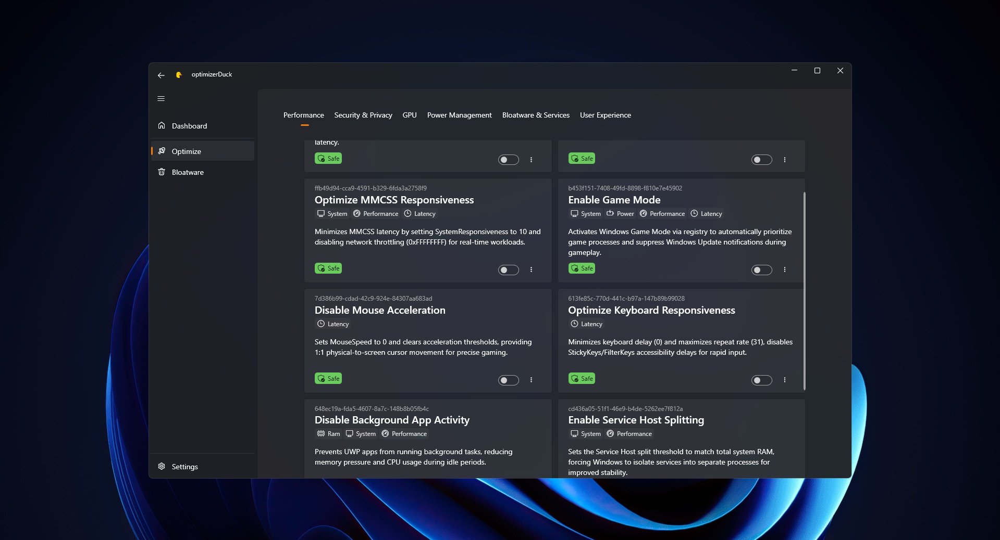
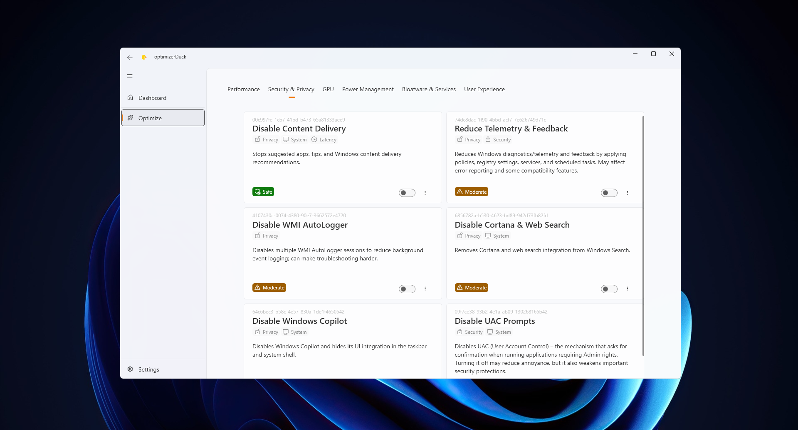
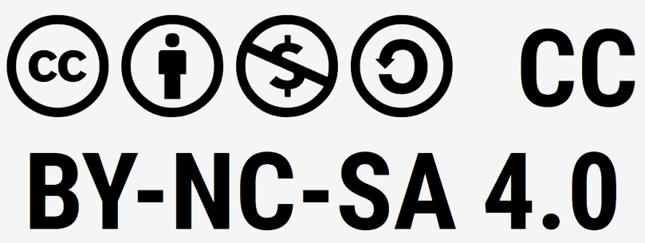

# optimizerDuck

**optimizerDuck is a free, open-source Windows optimization tool built for performance, privacy, and simplicity.**

 

  
<b>Light Mode</b>

   
  

---

## 🚀 Quick Start

### Download & Run

1. Download the latest release from **GitHub**  
   👉 https://github.com/itsfatduck/optimizerDuck/releases/latest
2. Run the `.exe` file (no installer required)

> [!TIP]
> Remember to restart your PC after applying optimizations to see the changes take effect.
>
> Also remember to create a restore point or backup before applying optimizations.

### Multi-Language Support

optimizerDuck currently supports:

- 🇺🇸 **English** (United States)
- 🇻🇳 **Vietnamese** (Tiếng Việt)

_More languages may be added in the future._

---

## 📖 Documentation

Full documentation and advanced guides are available here:  

**[📚 Documentation](./Docs/index.md)**

---

## 🤝 Contributing

Contributions are welcome!

You can help by:

* Reporting bugs
* Suggesting improvements
* Submitting pull requests
* Improving translations
* Enhancing documentation

Please follow project guidelines when contributing.

---

## 💖 Support the Project

If optimizerDuck improved your PC experience:

* ⭐ Star the repository
* 📢 Share it with others
* 💬 Join the Discord community
* 🎁 Support me via **[Support Page](./SUPPORT.md)**

Every star and contribution helps keep the project growing.

---

## 💬 Community, Contributing & Support

- 💬 [Discord](https://discord.gg/tDUBDCYw9Q) → Live chat & support
- 🐞 [Issues](https://github.com/itsfatduck/optimizerDuck/issues) → Bug reports
- 💡 [Discussions](https://github.com/itsfatduck/optimizerDuck/discussions) → Feature requests
- 📚 [Third-Party Notices](./THIRD-PARTY-NOTICES.md) → open source acknowledgments

> [!TIP]
> Before asking for help, check the docs and existing issues — your answer may already be there.

---

## ⚠️ Disclaimer

optimizerDuck is provided **"as is"**, without warranty of any kind.

By using this tool, you agree that the authors are **not responsible** for:

- System instability
- Data loss
- Performance issues caused by third-party software or user modifications

Always create a **restore point or backup** before applying system changes.

---

## DMCA & Attribution

optimizerDuck is an independent open-source project built from scratch.

Some ideas and tweaks are inspired by community research and other open-source tools (for example, WinUtil). Unless explicitly stated, **all code in this repository is original**.

If you believe any part of this project violates your copyright, please open an issue or submit a DMCA request via GitHub. Valid requests will be reviewed promptly and respectfully.

---

## ⚖️ License

This project is licensed under the **[CC BY-NC-SA 4.0 License](https://creativecommons.org/licenses/by-nc-sa/4.0/)**.  
See the [LICENSE](./LICENSE) file for details.

---

## ⭐ Star History

If optimizerDuck helped improve your PC, consider giving the repo a ⭐ and sharing it with others.  
**Every star** helps motivate future improvements and features.

<a href="https://www.star-history.com/#itsfatduck/optimizerDuck&type=timeline&legend=top-left">
 <picture>
   <source media="(prefers-color-scheme: dark)" srcset="https://api.star-history.com/svg?repos=itsfatduck/optimizerDuck&type=timeline&theme=dark&legend=top-left" />
   <source media="(prefers-color-scheme: light)" srcset="https://api.star-history.com/svg?repos=itsfatduck/optimizerDuck&type=timeline&legend=top-left" />
   
 </picture>
</a>
