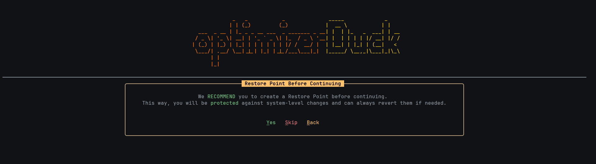

# optimizerDuck

**optimizerDuck is a free, open-source Windows optimization tool built for performance, privacy, and simplicity.**

 

---

# Table of Contents

1. [Quick Start](#quick-start)
2. [Features](#features)
3. [Safety First](#safety-first)
4. [Mindset Matters](#mindset-matters)
5. [Why I Built optimizerDuck](#why-i-built-optimizerduck)
6. [Community & Support](#community--support)
7. [Contributing](#contributing)
8. [Acknowledgments](#acknowledgments)
9. [Disclaimer](#disclaimer)
10. [License](#license)
11. [Star History](#star-history)

---

## Quick Start

1. [Download the latest release](https://github.com/itsfatduck/optimizerDuck/releases/latest)  
2. Run the `.exe` file  
3. Restart your PC for some tweaks to take effect

---

## Features

> **Note:** The list below is a *preview* of what optimizerDuck can do.  
> Features may change, be renamed, or expand over time. 

Here's a breakdown of the tweaks available in optimizerDuck, organized by category:

### Performance
- **Disable Background Apps:** Stops background apps from running to free up RAM and CPU.
- **Optimize Process Priority:** Adjusts foreground app priority for better responsiveness and reduced input lag.
- **Optimize Gaming Scheduling:** Prioritizes GPU and system resources for gaming.
- **SvcHost Split Threshold:** Optimizes service isolation based on system RAM to improve stability.
- **Disable Game Bar:** Disables the Xbox Game Bar overlay and background services to improve in-game performance.
- **Enable Game Mode:** Enables Windows Game Mode for a better gaming experience (Recommended on Windows 11).
- **Disable Game DVR:** Turns off background video recording to reduce latency.
- **GPU Optimization:** Optimizes AMD, NVIDIA, and Intel GPU driver settings for better stability and performance.

### Bloatware & Services
- **Remove Bloatware Apps:** Removes pre-installed bloatware to free up storage and system resources.
- **Debloat Microsoft Edge:** Reduces Edge's system integration and disables unnecessary features.
- **Configure Services:** Disables unnecessary background services to reduce resource consumption.

### Power
- **Disable Hibernate:** Disables hibernation and Fast Startup to save disk space and prevent issues.
- **Disable USB Power Saving:** Prevents USB selective suspend to reduce input lag on peripherals.
- **Install optimizerDuck Power Plan:** Installs a custom high-performance power plan for maximum CPU performance.
- **Disable Power Saving:** Disables system-wide power throttling for maximum responsiveness.

### Security & Privacy
- **Disable User Account Control (UAC):** Disables UAC prompts for fewer interruptions (use with caution).
- **Disable Telemetry:** Disables Windows data collection services, scheduled tasks, and error reporting.
- **Disable WMI AutoLogger:** Disables diagnostic event tracing services.
- **Disable Content Delivery Manager:** Disables ads, suggested apps, and content recommendations.
- **Disable Cortana & Search AI:** Disables Cortana, cloud search, and web search integration.
- **Disable Windows Copilot:** Disables AI Copilot integration in the taskbar and Explorer.

### User Experience
- **Taskbar Optimization:** Cleans up the taskbar by hiding the search bar, Task View, and other clutter.
- **Enable Dark Mode:** Forces dark mode for both applications and the system UI.
- **Explorer Optimization:** Restores the classic context menu, improves folder navigation, and enhances usability.
- **Optimize Visual Performance:** Adjusts visual effects for best performance over appearance.
- **Disable Notifications:** Disables all notifications to minimize distractions.
- **Optimize Mouse & Keyboard:** Disables mouse acceleration and improves keyboard responsiveness.
- **Install ZwTimerResolution:** Installs a service to reduce input lag and improve system responsiveness.

---

## Safety First

- **Ask for restore points** before making changes
- **Modular design** - apply only what you want
- **Extensive testing** on various hardware configurations
- **Open source** - you can check every line of code
- **Manual testing** - All tweaks have been manually tested across multiple hardware configurations
- **Logging** - Detailed logging file can be found in `%APPDATA%/optimizerDuck/` directory

---

## Mindset Matters

* A powerful PC means little if it's not used efficiently.
* Real performance isn't just about tweaks or tools. It's about **how you manage your system**.

**Best practices:**
- Keep your OS lean: avoid unnecessary VPNs, multiple antiviruses, or background apps.
- When gaming, close what you don't need (browsers, IDEs, chat apps, etc.).
- Fewer distractions = more resources for what really matters.

---

## Why I Built optimizerDuck

I run games on a **low-spec PC**, so smooth play is always a struggle. I spent hours digging through forums and community threads, trying everything I could find: **editing configs**, **applying `.reg` tweaks**, **running shell commands**, and **using third-party tools**. Those tweaks helped, but I never found a "**tweaker**" that felt right. Some **cost money**, some **looked fake**, and many **didn't** let me choose the exact changes I wanted.

I made this tool because I enjoy tweaking my system and wanted something simple and honest I could control. **Every tweak** here has been **tested** by me and carefully chosen to improve gameplay without surprises.

---

## Community & Support

- [Discord](https://discord.gg/tDUBDCYw9Q) → chat & support  
- [Issues](https://github.com/itsfatduck/optimizerDuck/issues) → bug reports  
- [Discussions](https://github.com/itsfatduck/optimizerDuck/discussions) → share tips  

---

## Contributing

We welcome contributions from the community!  
- Read the [CONTRIBUTING.md](./CONTRIBUTING.md) for step‑by‑step guidelines.  
- Please follow our [CODE_OF_CONDUCT.md](./CODE_OF_CONDUCT.md) to keep the community respectful and inclusive.  
- Open a [GitHub Issue](https://github.com/itsfatduck/optimizerDuck/issues) or start a [Discussion](https://github.com/itsfatduck/optimizerDuck/discussions) if you have ideas or feedback.  

---

## Acknowledgments

- **[Spectre.Console](https://spectreconsole.net/)** - A modern, cross-platform, and highly customizable terminal interface library for .NET.
- **[Serilog](https://serilog.net/)** - A flexible logging framework for .NET applications.
- **[vertical-spectreconsolelogger](https://github.com/verticalsoftware/vertical-spectreconsolelogger/)** - A seriously customizable [Spectre Console](https://spectreconsole.net/) provider for Microsoft.Extensions.Logging.
- **[WinUtil](https://github.com/ChrisTitusTech/winutil)** - A collection of Windows optimization scripts and tools by Chris Titus Tech.
- **[Microsoft Docs](https://docs.microsoft.com/en-us/)** - Official documentation for Windows and .NET.
- And many more open-source contributors who helped make this project possible.

---

## Disclaimer

optimizerDuck is provided "as is", without warranty of any kind.  
By using this tool, you agree that the authors are **not responsible** for any damage, data loss, or issues that may occur.  
Always create a restore point or backup before applying changes.

### DMCA & Attribution Disclaimer

optimizerDuck is an independent open‑source project built from scratch.  
While many tweaks are inspired by community forums and other open‑source projects (such as WinUtil), all code in this repository was written by the author unless otherwise stated.

If you believe any part of this project infringes your copyright, please open an issue or submit a DMCA request via GitHub. We respect intellectual property and will review any valid request promptly.

---

## License

This project is licensed under the [CC BY-NC-SA 4.0 License](https://creativecommons.org/licenses/by-nc-sa/4.0/). see the [LICENSE](./LICENSE) file for details.

---

## Star History

**If optimizerDuck made your PC faster, give it a star! ⭐** It helps more people discover the project and keeps development going.

