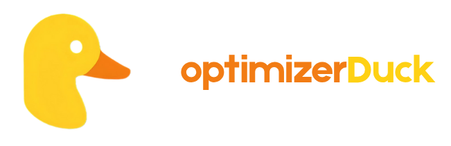
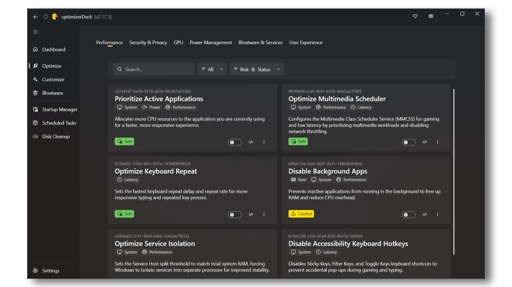

# [optimizerDuck](https://optimizerduck.vercel.app/)

**optimizerDuck is a free, open-source Windows optimization tool built for performance, privacy, and simplicity.**

 

[Quick Start](#quick-start) • [Documentation](#documentation) • [Contributing](#contributing) • [Support](#support) • [Community](#community) • [Disclaimer](#disclaimer) • [License](#license)

Star History

If optimizerDuck helped improve your PC, consider giving the repo a ⭐ and sharing it with others.  
**Every star** helps motivate future improvements and features.

<a href="https://www.star-history.com/#itsfatduck/optimizerDuck&type=timeline&legend=top-left">
 <picture>
   <source media="(prefers-color-scheme: dark)" srcset="https://api.star-history.com/svg?repos=itsfatduck/optimizerDuck&type=timeline&theme=dark&legend=top-left" />
   <source media="(prefers-color-scheme: light)" srcset="https://api.star-history.com/svg?repos=itsfatduck/optimizerDuck&type=timeline&legend=top-left" />
   
 </picture>
</a>

---

## Quick Start

### Download & Run

1. Download the latest release from **GitHub**  
   https://github.com/itsfatduck/optimizerDuck/releases/latest
2. Run the `.exe` file (no installer required)

> [!TIP]
> Remember to restart your PC after applying optimizations to see the changes take effect.
>
> Also remember to create a restore point or backup before applying optimizations.

### Multi-Language Support

optimizerDuck currently supports the following languages:

- 🇺🇸 **English** (United States) - _Primary & recommended_
- 🇻🇳 **Vietnamese** (Tiếng Việt)
- 🇹🇼 **Traditional Chinese** (正體中文) - translation by [abc0922001](https://github.com/abc0922001)

> [!NOTE]
>
> - **English is the primary and recommended language**, as it provides the most accurate, complete, and stable descriptions across all features and optimizations.
> - If you would like to help translate optimizerDuck into your language, please take a look at [Contributing Guidelines](./.github/CONTRIBUTING.md).

## Documentation

Full documentation and advanced guides are available here:

### [optimizerDuck Documentation](https://optimizerduck.vercel.app/docs/guides/getting-started)

## Support & Community

If optimizerDuck improved your PC experience:

- ⭐ Star the repository
- 📢 Share it with others
- 💬 Join the Discord community
- 🎁 Support me via **[Support](https://optimizerduck.vercel.app/docs/contribute/support-me)**

### Get Help & Connect

- 🌐 [Website](https://optimizerduck.vercel.app/) - Official Website & Documentation
- 💬 [Discord](https://discord.gg/tDUBDCYw9Q) - Live chat & support
- 🐞 [Issues](https://github.com/itsfatduck/optimizerDuck/issues) - Bug reports and feature requests

### Contributing

Contributions are welcome! Please read the [Contributing Guidelines](./.github/CONTRIBUTING.md) for more details.

## Disclaimer

optimizerDuck is provided **"as is"**, without warranty of any kind.

By using this tool, you agree that the authors are **not responsible** for:

- System instability
- Data loss
- Performance issues caused by third-party software or user modifications

Always create a **restore point or backup** before applying system changes.

## DMCA & Attribution

optimizerDuck is an independent open-source project built from scratch.

Some ideas and tweaks are inspired by community research and other open-source tools (for example, WinUtil). Unless explicitly stated, **all code in this repository is original**.

If you believe any part of this project violates your copyright, please open an issue or submit a DMCA request via GitHub. Valid requests will be reviewed promptly and respectfully.

## License

This project is licensed under the **[GPL v3 License](https://www.gnu.org/licenses/gpl-3.0.en.html)**.  
See the [LICENSE](./LICENSE) file for details.

## Thanks to all Contributors

My application is starting to get new contributors. Thank you all so much for your support and contributions!

