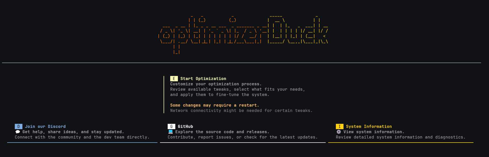
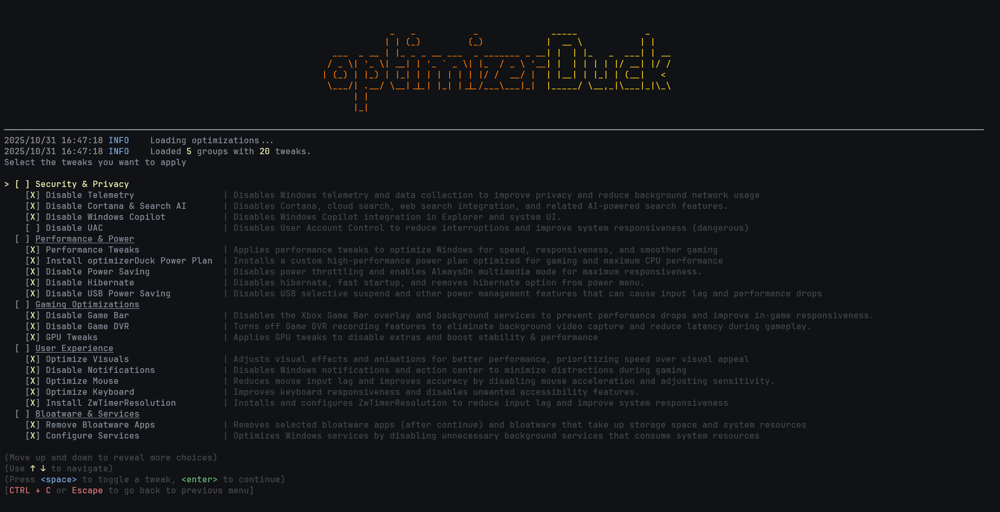

# optimizerDuck

**optimizerDuck is a free, open-source Windows optimization tool built for performance, privacy, and simplicity.**

 

---

# Table of Contents

1. [Quick Start](#quick-start)
2. [Documentation](#documentation)
3. [Key Optimizations](#key-optimizations)
4. [Mindset Matters](#mindset-matters)
5. [Why I Built optimizerDuck](#why-i-built-optimizerduck)
6. [Community & Support](#community--support)
7. [Contributing](#contributing)
8. [Disclaimer](#disclaimer)
9. [License](#license)
10. [Star History](#star-history)

---

## Quick Start

1. [Download the latest release](https://github.com/itsfatduck/optimizerDuck/releases/latest)  
2. Run the `.exe` file  

> **Note:** Restart your PC for some tweaks to take effect

### Documentation

For more detailed guides, check out the [docs](./Docs/index.md).

---

## Key Optimizations

optimizerDuck helps you fine‑tune Windows in five main areas:

- **Performance** → Improve CPU/GPU responsiveness and reduce input lag for gaming
- **Debloat & Services** → Remove unnecessary apps and disable background services
- **Power** → Optimize power plans for maximum performance
- **Privacy & Security** → Limit telemetry, disable Cortana, Copilot, and system ads
- **User Experience** → Clean up the taskbar, improve Explorer, enable Dark Mode, and enhance input devices

👉 See the full list in [Docs/Features](./Docs/features.md)

---

## Mindset Matters

> A powerful PC means little if it's not used efficiently.
> 
> Real performance isn't just about tweaks or tools. It's about **how you manage your system**.

**Best practices:**
- Keep your OS lean: avoid unnecessary VPNs, multiple antiviruses, or background apps.
- When gaming, close what you don't need (browsers, IDEs, chat apps, etc.).
- Fewer distractions = more resources for what really matters.

---

## Why I Built optimizerDuck

I run games on a **low-spec PC**, so smooth play is always a struggle. I spent hours digging through forums and community threads, trying everything I could find: **editing configs**, **applying `.reg` tweaks**, **running shell commands**, and **using third-party tools**. Those tweaks helped, but I never found a "**tweaker**" that felt right. Some **cost money**, some **looked fake**, and many **didn't** let me choose the exact changes I wanted.

I made this tool because I enjoy tweaking my system and wanted something simple and honest I could control. **Every tweak** here has been **tested** by me and carefully chosen to improve gameplay without surprises.

---

## Community & Support

- [Discord](https://discord.gg/tDUBDCYw9Q) → chat & support  
- [Issues](https://github.com/itsfatduck/optimizerDuck/issues) → bug reports  
- [Discussions](https://github.com/itsfatduck/optimizerDuck/discussions) → share tips  

---

## Contributing

We welcome contributions from the community!  
- Read the [CONTRIBUTING.md](./CONTRIBUTING.md) for step‑by‑step guidelines.  
- Please follow our [CODE_OF_CONDUCT.md](./CODE_OF_CONDUCT.md) to keep the community respectful and inclusive.  
- Open a [GitHub Issue](https://github.com/itsfatduck/optimizerDuck/issues) or start a [Discussion](https://github.com/itsfatduck/optimizerDuck/discussions) if you have ideas or feedback.  

---

## Disclaimer

optimizerDuck is provided "as is", without warranty of any kind.  
By using this tool, you agree that the authors are **not responsible** for any damage, data loss, or issues that may occur.  
Always create a restore point or backup before applying changes.

### DMCA & Attribution Disclaimer

optimizerDuck is an independent open‑source project built from scratch.  
While many tweaks are inspired by community forums and other open‑source projects (such as WinUtil), all code in this repository was written by the author unless otherwise stated.

If you believe any part of this project infringes your copyright, please open an issue or submit a DMCA request via GitHub. We respect intellectual property and will review any valid request promptly.

---

## License

This project is licensed under the [CC BY-NC-SA 4.0 License](https://creativecommons.org/licenses/by-nc-sa/4.0/). see the [LICENSE](./LICENSE) file for details.

---

## Star History

If optimizerDuck made your PC faster, **star this repo** and share it with friends. 
Every ⭐ motivates new tweaks and updates!

